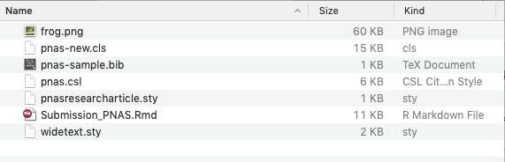
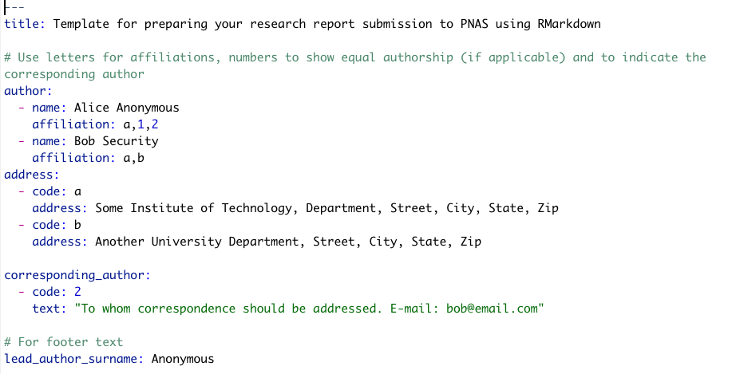

```{r packages, echo=FALSE, warning=FALSE, include=FALSE}
library(knitr)
library(rmarkdown)
library(bookdown)
library(formattable)
library(kableExtra)
library(dplyr)
library(magrittr)
library(prettydoc)
library(htmltools)
library(knitcitations)
library(devtools)
library(rticles)
library(remotes)

#Generate BibTex citation file for all R packages used to produce report
knitr::write_bib(.packages(), file = 'packages.bib')
```

```{r setup, include=FALSE, cache=FALSE, message = FALSE}
# Chunk options: see http://yihui.name/knitr/options/ ###

## Text results
#opts_chunk$set(echo = TRUE, warning = TRUE, message = TRUE, include = TRUE)

## Code decoration
opts_chunk$set(tidy = TRUE, tidy.opts = list(blank = FALSE, width.cutoff = 60), highlight = TRUE)

## Caching code
opts_chunk$set(cache = 2, cache.path = "cache/")

## Plots
#opts_chunk$set(fig.path = "Figures_MS/", dev=c('pdf', 'png'), dpi = 300)

## Locate figures as close as possible to requested position (=code)
knitr::opts_chunk$set(fig.pos = 'H')
```

# Used literature and web resources

This chapter is mostly based on the following books and web resources:

- **Bookdown ebook on writing scientific papers:** https://bookdown.org/yihui/rmarkdown/journals.html

- **A blog on "Writing papers in R Markdown" by Francisco Rodriguez-Sanchez:** https://sites.google.com/site/rodriguezsanchezf/news/writingpapersinrmarkdown

- **rmdTemplates R package GitHub repository:** https://github.com/Pakillo/rmdTemplates

- **rcticles R package GitHub repository:** https://github.com/rstudio/rticles

# Challenge to writing publications in R Markdown

Traditionally, journals are accepting manuscripts submitted in either Word (`.doc`) or LaTex (`.tex`) formats. In addition, most journals are requesting figures to be submitted as separate files (in e.g. `.tiff` or `.eps` formats). Online submission platforms are collating your different files to produce a `.pdf` document, which is shared with reviewers for evaluation. In this context, although the `.Rmd` format is growing in popularity (due to its ability to "mesh" data analyses with data communication), this format is technically currently not accepted by journals. In this document, we are discussing ways that have been developed to circumvent this issue and allow using the approach implemented in R Markdown for journal submissions.

# Solution: Develop `.Rmd` templates producing `.tex` files matching journal requirements!

As mentioned above, many journals support the LaTeX format (`.tex`) for manuscript submissions. While you can convert R Markdown (`.Rmd`) to LaTeX, different journals have different typesetting requirements and LaTeX styles. **The solution is to develop scripts converting R Markdown files into LaTex files, which are meeting journal requirements.**

# The *rticles* package

Submitting scientific manuscripts written in R Markdown is still challenging; however the R [*rticles*](https://cran.r-project.org/web/packages/rticles/index.html) package was designed to simplify the creation of documents that conform to submission standards for academic journals[see @R-rticles]. The package provides a suite of custom R Markdown LaTeX formats and templates for the following journals/publishers that are relevant to the EEB program:

- Biometrics articles
- Elsevier journal submissions
- Frontiers articles
- MDPI journal submissions
- PeerJ articles
- PNAS articles
- Royal Society Open Science journal submissions
- Sage journal submissions
- Springer journal submissions
- The R Journal articles
- Taylor & Francis articles

An understanding of LaTeX is recommended, but not essential in order to use this package. R Markdown templates may sometimes inevitably contain LaTeX code, but usually we can use the simpler R Markdown and *knitr* function to produce elements like figures, tables, and math equations.

## Install and use *rticles* templates to write publications

1. Install the *rticles* package:

  - Type the above code in the R console:

```{r, eval = FALSE}
install.packages("rticles")
```

  - Or use the RStudio interface to install the package by clicking:

```{r, eval = FALSE}
Tools -> Install Packages...

Then, type "rticles" in the prompted window to install package. 
```

  - If you wish to install the development version from GitHub (which often contains new article formats), you can do this [note that this code uses a function from the *remotes* package; @R-remotes]:
  
```{r, eval = FALSE}
remotes::install_github("rstudio/rticles")
```

2. Create a new R Markdown document in RStudio:

```{r, eval = FALSE}
File -> New File -> R Markdown... 
```

3. In the `New R Markdown` window, click on `From Template` in the left panel and select the journal style that you would like to follow for your article (here PNAS Journal Article; see Figure \@ref(fig:RMarkTemplate)). Before pushing the `OK` button, provide a name for your project and set a location where the project will be saved (\@ref(fig:RMarkTemplate)). 

```{r RMarkTemplate, echo=FALSE, fig.cap="R Markdown window allowing to select templates following journal styles.", fig.align = 'center', out.width = '60%'}
knitr::include_graphics("Figures/New_RMarkdown_window.png")
```

4. Once you completed this task, a folder will be created (and saved in the path that you provided) containing files associated with the article submission process and the template will be automatically opened in RStudio (see Figure \@ref(fig:filestr)).

```{r filestr, echo=FALSE, fig.cap="Snapshot showing the template R Markdown and the associated folder created to generate your submission.", fig.align = 'center', out.width = '80%'}
knitr::include_graphics("Figures/Structure_files.png")
```

5. In this example, the following suite of files were created (see Figure \@ref(fig:filestr2)):
  - `Submission_PNAS.Rmd`: R Markdown file that will be used to write your article.
  - `pnas-sample.bib`: BibTeX file to store your bibliography.
  - `pnas.csl` and `pnas-new.cls`: Files containing information about the formatting of citations and bibliography adapted to journal policies. 
  - `frog.png`: A `.png` file used to show you how to include figures in `.Rmd` document.

```{r filestr2, echo=FALSE, fig.cap="Snapshot showing the suite of files associated to your submission and saved in your project folder.", fig.align = 'center', out.width = '60%'}

```

5. Start writing your article
  - Open `Submission_PNAS.Rmd` and update the YAML metadata section with information on authors, your abstract, summary and keywords (see Figure \@ref(fig:YAML)).

```{r YAML, echo=FALSE, fig.cap="Update YAML metadata section with information on authors, your abstract, summary and keywords.", fig.align = 'center', out.width = '80%'}

```
  - Write your manuscript by following the journal's structure. You can take advantage of the R Markdown language in your manuscript (e.g. include R code chunks and outputs) and those will be converted by *knitr* and *rtciles* packages during the compilation procedure.

4. Compile your document and use both `.pdf` and `.tex` files to submit your article (see Figure \@ref(fig:Subm)). The output files will be saved in your project folder.

```{r Subm, echo=FALSE, fig.cap="Snapshot of the procedure to knit the document.", fig.align = 'center', out.width = '80%'}
knitr::include_graphics("Figures/Compiled_file.png")
```

# Exercise

To get familiar with this procedure, please practice by applying it to different journal templates favoring those you might submit to. 

Enjoy!

# References

<div id="refs"></div>

# (APPENDIX) Appendix {-}

# Appendix 1

Citations of all R packages used to generate this report. 

```{r generateBibliography, results="asis", echo=TRUE, warning = FALSE, message=FALSE}
library("knitcitations")
cleanbib()
options("citation_format" = "pandoc")
read.bibtex(file = "packages.bib")
``` 

# Appendix 2

Version information about R, the operating system (OS) and attached or R loaded packages. This appendix was generated using `sessionInfo()`.

```{r eval=T, echo=F, warning = FALSE, message=FALSE}
sessionInfo()
```
